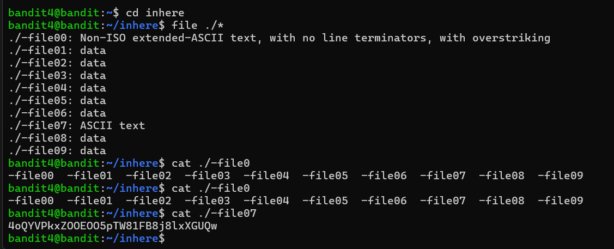

# CTF Bandit Overthewire - Level 0 - Level 30

## Level 0 → Level 1
#### 🎯 Goal
```bash
The password is stored in the readme situated in the home directory. SSH to the 2220 and continue to grab the password.
```
#### 🧩 Explain the concept
SSH is a secure shell protocol used to securely remote into machines. It helps us to encrypt the communication over the network. 

``` bash 
ssh username@hostname -p port_number
```
#### 💻 Command 
```bash
ssh bandit0@bandit.labs.overthewire.org -p 2220
cat readme
```
#### 🔓Password for next level
```bash
ZjLjTmM6FvvyRnrb2rfNWOZOTa6ip5If
```

#### 📜 Output 


#### 📘What have I learned?
```bash
In this level 0 I have learned how to ssh into the bandit0 to get started.
```

---
## Level 1 → Level 2
#### 🎯 Goal  
```bash
The password is stored in the - situated in the home directory. Gather the password for 'bandit2'
```
#### 🧩 Explain the concept
```
'-' is a special symbol in linux. '-' should not be used to create to start the file. 
```
#### 💻 Commands
```bash
ssh bandit1@bandit.labs.overthewire.org -p 2220

cat ./-
```
#### 🔓Password for next level
```bash
263JGJPfgU6LtdEvgfWU1XP5yac29mFx
```
#### 📜 Output 


#### 📘 What have I learned?
```bash
In this level 1 I have learned how to cat special file such as '-' using the command cat ./-. 
```

---
## Level 2 → Level 3
#### 🎯 Goal  
```bash
The password is stored in the "-spaces in this filename" located under the home directory. Gather password for bandit3.
```
#### 🧩 Explain the concept
```
'--' is used as option in linux. If we try to cat --spaces-- it won't run as it will take it as option for the cat but to run this we have to use ./--space and there is spaces in the filename we need to include quotation "-- filename". 
```
#### 💻 Commands
```bash
ssh bandit2@bandit.labs.overthewire.org -p 2220
ls -la
cat "./--spaces in this filename"
```
#### 🔓Password for next level
```bash
MNk8KNH3Usiio41PRUEoDFPqfxLPlSmx
```
#### 📜 Output 


#### 📘 What have I learned?
```bash
In this level 2, we learned about how we can cat a special file using spaces and dashes. 
```
---

## Level 3 → Level 4
#### 🎯 Goal 
```bash
The password is stored in the hidden file inhere. Gather password for bandit4. 
```
#### 🧩 Explain the concept
```
The file is stored in hidden directory inhere. Linux start hidden file with '.'. The directory inhere will not show its content using ls but with -a it shows hidden files as well. 
```
#### 💻 Commands
```bash
ssh bandit3@bandit.labs.overthewire.org -p 2220
ls -la
cat "./--spaces in this filename"
```
#### 🔓Password for next level
```bash
2WmrDFRmJIq3IPxneAaMGhap0pFhF3NJ
```
#### 📜 Output 


#### 📘What have I learned?
```bash
In this level 3 have learned how to view hidden files in the directory and get its content. 
```
---


## Level 4 → Level 5
#### 🎯 Goal 
```bash
The password is stored in the human readable file in inhere directory. Gather the password for bandit5.
```
#### 🧩 Explain the concept
```
The file for password has stored the password in human readable format. So the stored password is readable by human. There are multiple types of data such as ELF, ASCII, perl script etc. '*' is used in this level to find the data in the file as there are multiple files in the inhere directory. 
```
#### 💻 Commands
```bash
ssh bandit4@bandit.labs.overthewire.org -p 2220
cd inhere
file ./*
cat "./-file07"
```
#### 🔓Password for next level
```bash
4oQYVPkxZOOEOO5pTW81FB8j8lxXGUQw
```
#### 📜 Output 


#### 📘What have I learned?
``` bash 
In this level 4 have learned how to view data type in a file using the wildcard. 
```
---


## Level 5 → Level 6
#### 🎯 Goal 
```bash
The password is stored in inhere directorywith human-readable, 1033 bytes in size, not executable. Gather password for bandit6. 
```
#### 🧩 Explain the concept
```
'file' help us find the human readable file in the directory. 'find' is very powerful tool in linux. It helps us find the correct file using the operator - size, -type f. 
```
#### 💻 Commands
```bash
ssh bandit5@bandit.labs.overthewire.org -p 2220
cd inhere
ls -la
ls -la maybehere00
find . -type f size 1033c
cat maybehere07/.file2
```
#### 🔓Password for next level
```bash
HWasnPhtq9AVKe0dmk45nxy20cvUa6EG
```
#### 📜 Output 


#### 📘What have I learned?
``` bash 
In this level 5 I have learned about finding a file using its file type, size and the execution information. It teaches us how we can search systematically using file attributes. 
```
---
## Level 6 → Level 7
#### 🎯 Goal 
```bash
The password is stored a random file on the server. File has few characteristics - owned by user bandit7, owned by group bandit6, 33 bytes in size. Gather password for bandit7. 
```
#### 🧩 Explain the concept
``` bash
Using the 'find' tool we are going to add few attributes to help us find this file on the server. '-type f' - look for file, '-user bandit7' - owns by bandit7,'-group bandit6' - owned group is bandit6,'-size 33c'- size is 33 bytes. '2>/dev/null' this is used to hide all the error messages appearing while running the command. 
```
#### 💻 Commands
```bash
ssh bandit6@bandit.labs.overthewire.org -p 2220
ls
find / -user bandit7 -group bandit6 -size 33c 2>/dev/null
cat /var/lib/dpkg/info/bandit7.password
```
#### 🔓Password for next level
```bash
morbNTDkSW6jIlUc0ymOdMaLnOlFVAaj
```
#### 📜 Output 


#### 📘What have I learned?
``` bash 
In this level 6 I have learned about the groups and users which we can defined to find a particular file without any knowledge about that file on the server. 
```
---

## Level 7 → Level 8
#### 🎯 Goal 
```bash
The password is stored a in a file called data.txt with the word millionth. Gather password for bandit8.
```
#### 🧩 Explain the concept
```bash
If the file is large and with huge amount of lines we can't go through each line to find the answer. 'grep' command is used to search for a lines in the file with multiple lines. We can use '|' to gather the information and look through the text file. 
```
#### 💻 Commands
```bash
ssh bandit7@bandit.labs.overthewire.org -p 2220
ls
grep -a "millionth" data.txt
```
#### 🔓Password for next level
```bash
dfwvzFQi4mU0wfNbFOe9RoWskMLg7eEc
```
#### 📜 Output 


#### 📘What have I learned?
``` bash 
In this level 7, learned how to use grep to find information from the file without going through each line in the file. It helps us save our time to find specific line. 
```
---

## Level 8 → Level 9
#### 🎯 Goal 
```bash
The password is stored a in a file called data.txt with the line on text occurs only once. Gather password for bandit9.
```
#### 🧩 Explain the concept
```bash
For the uniqueness we can use a default option of 'uniq' in Linux. It basically only displays the lines that are not repeated or unique in the file. 'uniq -u' keeps the line which are unique. 
```
#### 💻 Commands
```bash
ssh bandit8@bandit.labs.overthewire.org -p 2220
ls
sort data.txt | uniq -u
```
#### 🔓Password for next level
```bash
4CKMh1JI91bUIZZPXDqGanal4xvAg0JM
```
#### 📜 Output 


#### 📘What have I learned?
``` bash 
In this level 8, learned how to use uniq command to filter out repeated lines in the file.We firstly sorted the lines and that displayed it with the uniq -u option. 
```
---

## Level 9 → Level 10
#### 🎯 Goal 
```bash
The password is stored a in a file called data.txt with the human readable string with '=' characters. Gather password for bandit10.
```
#### 🧩 Explain the concept
```bash
'Strings' is used to extract the  prints sequences of printable text from a binary file. This is helpful for forensics and reverse engineering. 
```
#### 💻 Commands
```bash
ssh bandit9@bandit.labs.overthewire.org -p 2220
ls
strings data.txt | grep "="
```
#### 🔓Password for next level
```bash
FGUW5ilLVJrxX9kMYMmlN4MgbpfMiqey
```
#### 📜 Output 


#### 📘What have I learned?
``` bash 
In this level 9, I learned how extract human readable text from a binary text which is useful in forensics such as file analysis.  
```
---
## Level 10 → Level 11
#### 🎯 Goal 
```bash
The password is stored a in a file called data.txt with base64 encoded data. Gather password for bandit11
```
#### 🧩 Explain the concept
```bash
Base64 encodes the binary data to ASCII. Linux uses the command called base64 for encoding and decoding to base64. In this we are using '-d' to decode the base64.  
```
#### 💻 Commands
```bash
ssh bandit10@bandit.labs.overthewire.org -p 2220
ls
base64 -d data.txt
```
#### 🔓Password for next level
```bash
dtR173fZKb0RRsDFSGsg2RWnpNVj3qRr
```
#### 📜 Output 


#### 📘What have I learned?
``` bash 
In this level 10, I learned how to decode bas64 data using the option base64 -d to gather hidden information of the file.  
```
---
## Level 11 → Level 12
#### 🎯 Goal 
```bash
The password is stored a in a file called data.txt where all lowercase 'a-z' and uppercase 'A-Z' letters have been rotated by 13 positions. Gather password for bandit12.  
```
#### 🧩 Explain the concept
```bash
The password file has rotated the characters, which is called substitution cipher used in the security. Linux uses the 'tr' command to translate the replaced characters. To use that we can use command "tr <old_character> <new_character>". 
Following are the example: 
alias rot13="tr 'A-Za-z' 'N-ZA-Mn-za-m'"
alias rot5="tr '0-9' '5-90-4'"
```
#### 💻 Commands
```bash
ssh bandit11@bandit.labs.overthewire.org -p 2220
ls
tr 'A-Za-z' 'N-ZA-Mn-za-m' < data.txt 
```
#### 🔓Password for next level
```bash
7x16WNeHIi5YkIhWsfFIqoognUTyj9Q4
```
#### 📜 Output 


#### 📘What have I learned?
``` bash 
In this level 11, using the tr command we ROT13 to substitute characters and decoded the text.  
```
---

## Level 12 → Level 13
#### 🎯 Goal 
```bash
The password is stored a in a file called data.txt where the hexdump is repeatedly compressed.  We are going to make /tmp directory to work using 'mktemp -d'. 
```
#### 🧩 Explain the concept
```bash
- We are going to create a tmp directory in the /tmp directory. This can be done using "mktemp -d". Copying the data.txt file to the /tmp/tmp.5daM5ZvBzm.
- After copying we reverse the hexdump "mv data.txt hexdump_data". This will convert the ASCII hex to binary data. 
- Based on the the file output, rename them to compressed_data.gz, then decompress it with "gzip -d compressed_data.gz". If the file is bzip2 we change the name to compressed_data.bz2 and decompressed it to "bzip2 -d compressed_data.bz2".
- This process is continued for the gzip, bzip2, and tar for multiple times. 
- We performed the repeated process of the decompressing the file until we reach the point of plain text. In the end, we used the cat command to view the file information for bandit13 password. 
```
#### 💻 Commands
```bash
ssh bandit12@bandit.labs.overthewire.org -p 2220
ls
mktemp -d
cd /tmp/tmp.5daM5ZvBzm
cp ~/data.txt .
mv data.txt hexdump_data
ls
cat hexdump_data | head
xxd -r hexdump_data compressed_data
ls
cat compressed_data | head
cat hexdump_data
mv compressed_data compressed_data.gz
ls
gzip -d compressed_data.gz
ls
xxd compressed_data
mv compressed_data compressed_data.bz2
ls
bzip2 -d compressed_data.bz2
mv compressed_data compressed_data.gz
gzip -d compressed_data.gz
mv compressed_data compressed_data.gz
gzip -d compressed_data.gz
cat compressed_data
mv compressed_data compressed_data.tar
tar -xf compressed_data.tar 
ls
tar -xf data5.bin
xxd data8.bin
mv data8.bin data8.gz
gzip -d data8.gz
ls
cat data.gz
```
#### 🔓Password for next level
```bash
FO5dwFsc0cbaIiH0h8J2eUks2vdTDwAn
```
#### 📜 Output 


#### 📘What have I learned?
``` bash 
In this level 13, using the gzip, bzip2, and tar - we can compressed the data and extract the archives. 
```
---
## Level 13 → Level 14
#### 🎯 Goal 
```bash
The password is stored a in a file /etc/bandit_pass/bandit14 and can only be read by user bandit14. SSH into the next level instead of getting the password.   
```
#### 🧩 Explain the concept
```bash
This level teaches us to use the SSH private key to login to the next level instead of using the password directly. This can be done using the RSA key copying with scp command. To send the file to remote host we need to use the 'scp' command to transfer SSH data over the network. 
```
#### 💻 Commands
```bash
ssh bandit13@bandit.labs.overthewire.org -p 2220
ls
scp -P 2220 bandit13@bandit.labs.overthewire.org:sshkey.private .         
ssh -i sshkey.private bandit14@bandit.labs.overthewire.org -p 2220
```
#### 🔓Password for next level
```bash
MU4VWeTyJk8ROof1qqmcBPaLh7lDCPvS
```
#### 📜 Output 


#### 📘What have I learned?
``` bash 
In this level 13, using the ssh private keys for authentication instead of the password to securely remote into the machine. 
```
---
## Level 14 → Level 15
#### 🎯 Goal 
```bash
The password is retrieved by submitting password of current level at port 30000 on localhost.   
```
#### 🧩 Explain the concept
```bash
The local host uses the ip of 127.0.0.1. 'nc' or 'netcat' allows us to read and write data over the network and it is the simplest tool to gather raw TCP connection and sending/receiving plain text tp a port. As we have to get the password using the port 30000 - nc o r netcat is the used 'nc <host> <port>'.
```
#### 💻 Commands
```bash
ssh bandit14@bandit.labs.overthewire.org -p 2220
cat /etc/bandit_pass/bandit14
nc localhost 30000
```
#### 🔓Password for next level
```bash
8xCjnmgoKbGLhHFAZlGE5Tmu4M2tKJQo
```
#### 📜 Output 


#### 📘What have I learned?
``` bash 
In this level 14, using the nc or netcat we can gather raw TCP service and capture the remote machine's response.
```
---
## Level 15 → Level 16
#### 🎯 Goal 
```bash
The password is retrieved by submitting password of current level to port 30001 on localhost using SSL/TLS encryption.   
```
#### 🧩 Explain the concept
```bash
The local host uses the ip of 127.0.0.1. 'nc' or 'netcat' allows us to read and write data over the network and it is the simplest tool to gather raw TCP connection and sending/receiving plain text tp a port. As we have to get the password using the port 30000 - nc o r netcat is the used 'nc <host> <port>'.
```
#### 💻 Commands
```bash
ssh bandit15@bandit.labs.overthewire.org -p 2220
openssl s_client -connect localhost:30001
```
#### 🔓Password for next level
```bash
kSkvUpMQ7lBYyCM4GBPvCvT1BfWRy0Dx
```
#### 📜 Output 


#### 📘What have I learned?
``` bash 
In this level 15, using the openssl s_client we were able to inspect the TLS-wrapped services and read its output.
```
---

---
## Level 16 → Level 17
#### 🎯 Goal 
```bash
The password is retrieved by submitting password of current level to port 30001 on localhost using SSL/TLS encryption.   
```
#### 🧩 Explain the concept
```bash
In this task we have to find the open ports/services. NMAP helps us scan the network. The best way to do so is "nmap" to interact with correct service to retrieve data. '-p' is used for the ports attribute. '-sV' is for service and version detection. '-A' is for nmap to perform all possible scans. 
```
#### 💻 Commands
```bash
ssh bandit16@bandit.labs.overthewire.org -p 2220
nmap -sV localhost -p 31000-32000
openssl s_client -connect localhost:31790
echo kSkvUpMQ7lBYyCM4GBPvCvT1BfWRy0Dx | openssl s_client -connect localhost:31790 -quiet
cd /tmp
touch pvt16.key
nano pvt16.key
chmod 700 pvt16.key
ls -l pvt16.key
ssh -i pvt16.key bandit17@localhost
```
#### 🔓Password for next level
```bash
gvE89l3AhAhg3Mi9G2990zGnn42c8v20
```
#### 📜 Output 


#### 📘What have I learned?
``` bash 
In this level 16, learned how to use the nmap for network scanning using the given ports. Permission change was performed using the CHMOD command.
```
---
## Level 17 → Level 18
#### 🎯 Goal 
```bash
Two files in home directory - passwords.old & passwords.new. The password is in the passwords.new and it has been changed.    
```
#### 🧩 Explain the concept
```bash
In this task, 'diff' is used to print the difference between two files. 
```
#### 💻 Commands
```bash
ssh -i sshkey17.private
diff passwords.old passwords.new
sort passwords.old passwords.new | uniq -u
```
#### 🔓Password for next level
```bash
x2gLTTjFwMOhQ8oWNbMN362QKxfRqGlO4
```
#### 📜 Output 


#### 📘What have I learned?
``` bash 
In this level 17, learned about diff command which helps us difference between two files.
```
---
## Level 18 → Level 19
#### 🎯 Goal 
```bash
The password is stored in readme file in home directory. But someone has modified the .bashrc log which logs you out when login with ssh.    
```
#### 🧩 Explain the concept
```bash
.bashrc is a terminal file which loads everytime you login to the machine. SSH doesn't only log us into the machine but we can remotely execute the commands on the SSH.  
```
#### 💻 Commands
```bash
ssh bandit18@bandit.labs.overthewire.org -p 2220 ls  
ssh bandit18@bandit.labs.overthewire.org -p 2220 cat readme 
```
#### 🔓Password for next level
```bash
cGWpMaKXVwDUNgPAVJbWYuGHVn9zl3j8 
```
#### 📜 Output 


#### 📘What have I learned?
``` bash 
In this level 18, learned how to remote over SSH and bypass the login restrictions. 
```
---

## Level 19 → Level 20
#### 🎯 Goal 
```bash
Use setuid binary in homedirectory to access next level. The password is in /etc/bandit_pass.     
```
#### 🧩 Explain the concept
```bash
Setuid is a special permission for the linux, it replaces the x of the user permission. The binary runs as the owner binary instead of executing one. Command used for setuid is 'chmod u+s filename'. 
```
#### 💻 Commands
```bash
ssh bandit19@bandit.labs.overthewire.org -p 2220 
ls -la 
./bandit20-do
./bandit20-do ls /etc/bandit_pass
```
#### 🔓Password for next level
```bash
0qXahG8ZjOVMN9Ghs7iOWsCfZyXOUbYO
```
#### 📜 Output 


#### 📘What have I learned?
``` bash 
In this level 19, learned about special tool setuid used for the special permission which we can use for binary to execute as owner instead of user.
```
---

## Level 20 → Level 21
#### 🎯 Goal 
```bash
Using the setuid binary in home directory make a connection to localhost on port you specify. 
```
#### 🧩 Explain the concept
```bash
Netcat or nc which we learned earlier in the game. This level is about programs running with different privileges. Setuid binaries run with the permissiom of owner, not the user who launched them. Goal is to understand the program and grab password for level 21 using the setuid. 
```
#### 💻 Commands
```bash
ssh bandit19@bandit.labs.overthewire.org -p 2220
./bandit20-do
./bandit20-do cat /etc/bandit_pass/bandit20

```
#### 🔓Password for next level
```bash
EeoULMCra2q0dSkYj561DX7s1CpBuOBt
```
#### 📜 Output 


#### 📘What have I learned?
``` bash 
In this level 20, learned about netcat and 'nc -l' to capture the incoming data for the server/listener for data analysis.
```
---


## Level 21 → Level 22
#### 🎯 Goal 
```bash
The program runs on the cron interval. Look for the /etc/cron.d/ configuration. 
```
#### 🧩 Explain the concept
```bash

```
#### 💻 Commands
```bash
ssh bandit21@bandit.labs.overthewire.org -p 2220
ls -la /etc/cron.d
cat /etc/cron.d/cronjob_bandit22
cat /usr/bin/cronjob_bandit22.sh
chmod 644 /tmp/t7O6lds9S0RqQh9aMcz6ShpAoZKF7fgv
cat /etc/bandit_pass/bandit22 > /tmp/t7O6lds9S0RqQh9aMcz6ShpAoZKF7fgv
cat /tmp/t7O6lds9S0RqQh9aMcz6ShpAoZKF7fgv
```
#### 🔓Password for next level
```bash
tRae0UfB9v0UzbCdn9cY0gQnds9GF58Q
```
#### 📜 Output 


#### 📘What have I learned?
``` bash 
In this level 21, learned about scheduled jobs and related files which processes that programs using the cron.d.
```
---

## Level 22 → Level 23
#### 🎯 Goal 
```bash
The program runs on the cron interval. Look for the /etc/cron.d/ configuration. Look for a shell script for the useful skill. 
```
#### 🧩 Explain the concept
```bash
The cron job is explained above level but in this level we are going to use the variables in a bash scripting. Firstly, declare the variable using 'var_name=var_value'. Instead of providing the value we can write the command for the var_name. 
```
#### 💻 Commands
```bash
ssh bandit22@bandit.labs.overthewire.org -p 2220
ls -la /etc/cron.d
cat /etc/cron.d/cronjob_bandit23
cat /usr/bin/cronjob_bandit23.sh
echo I am user bandit23 | md5sum | cut -d ' ' -f 1
cat /tmp/8ca319486bfbbc3663ea0fbe81326349
```
#### 🔓Password for next level
```bash
0Zf11ioIjMVN551jX3CmStKLYqjk54Ga
```
#### 📜 Output 


#### 📘What have I learned?
``` bash 
In this level 22, I learned how to inspect cron jobs running under another user and how to read scripts in /etc/cron.d to find hidden outputs for that particular file. 
```
---

## Level 23 → Level 24
#### 🎯 Goal 
```bash
Creating a bash script to run for the cron.d which runs at regular interval. 
```
#### 🧩 Explain the concept
```bash
The cron jobs are run at the regular interval, this task explains us to write a script to place a file that cron job will later copy or execute as the cron owner. Basically, we are manipulating the environment for the scheduled ob to perform the action to reveal the password for next level. 
```
#### 💻 Commands
```bash
ssh bandit23@bandit.labs.overthewire.org -p 2220
 mktemp -d
 cd /tmp/tmp.MvfMpR7kwR
nano bandit24_pass.sh - 
" #!/bin/bash
cat /etc/bandit_pass/bandit24 > /tmp/tmp.ljEyl6kv1M/password"
chmod +rx bandit24_pass.sh 
chmod 777 /tmp/tmp.ljEyl6kv1M
touch password
chmod +rwx password 
ls -la
cat password 
```
#### 🔓Password for next level
```bash
gb8KRRCsshuZXI0tUuR6ypOFjiZbf3G8
```
#### 📜 Output 


#### 📘What have I learned?
``` bash 
In this level 23, I learned to create my own script for exploit cron jobs that copy files in a writable directory and get the results. 
```
---

## Level 24 → Level 25
#### 🎯 Goal 
```bash
A daemon is listening on 30002 and provides password for bandit25 with given secret 4 digit pin. 
```
#### 🧩 Explain the concept
```bash
Some of the program require us to enter the pins which might be a combination of lot of numbers. We can't go for guessing the number as it would consume a lot of time. Automation can be a simpler way to approach the program using the script. In this task, we will create the script to run the password and combination of the 4 digit pin. 
```
#### 💻 Commands
```bash
ssh bandit24@bandit.labs.overthewire.org -p 2220
nc localhost 30002
cd /tmp
mktemp -d
cd /tmp/tmp.
nano bruteforcepin.sh
" #!/bin/bash

for a in {0000..9999}
do
       echo gb8KRRCsshuZXI0tUuR6ypOFjiZbf3G8 $a >> possibilities.txt
done | nc localhost 30002 > keys.txt

cat keys.txt | grep bandit25" 
./bruteforcepin.sh
```
#### 🔓Password for next level
```bash
iCi86ttT4KSNe1armKiwbQNmB3YJP3q4
```
#### 📜 Output 


#### 📘What have I learned?
``` bash 
In this level 24, I learned about the program which interacts repeated by sending automated input using a loop or script to brute force a password. 
```
---


## Level 25 → Level 26
#### 🎯 Goal 
```bash
Bandit26 is not using the /bin/bash file. Logging to bandit25 to gather the password.  
```
#### 🧩 Explain the concept
```bash
It explains the use of the public-key SSH authentication. Instead of using the password to login we are using the private key file. SSH uses a keypair - private and public key. SSH just need to get proof for the private key and he can match the stored public key in the server. Vim text editor is used to edit the default shell for the user using ':shell' and :set shell=/bin/bash'. 
```
#### 💻 Commands
```bash
ssh bandit25@bandit.labs.overthewire.org -p 2220
cat /etc/passwd | grep bandit26
ls -la /usr/bin/showtext
ls 
chmod 700 bandit26.sshkey
ls
cat /etc/bandit\_pass/bandit26
```
#### 🔓Password for next level
```bash
s0773xxkk0MXfdqOfPRVr9L3jJBUOgCZ
```
#### 📜 Output 


#### 📘What have I learned?
``` bash 
In this level 25, I learned about connecting the different SSH key by switching the users with their private key file. 
```
---

## Level 26 → Level 27
#### 🎯 Goal 
```bash
Good job getting a shell! Now hurry and grab the password for bandit27!
```
#### 🧩 Explain the concept
```bash
Log into the bandit26 and it has file name bandit27-do. File is executable file as the binary runs with owner's permission the command executes the elevate rights. 
```
#### 💻 Commands
```bash
ssh bandit26@bandit.labs.overthewire.org -p 2220
ls
./bandit27-do
./bandit27-do cat /etc/bandit\_pass/bandit27

```
#### 🔓Password for next level
```bash
upsNCc7vzaRDx6oZC6GiR6ERwe1MowGB
```
#### 📜 Output 


#### 📘What have I learned?
``` bash 
In this level 26, I learned that we should not allow programs to run arbitary commands or setuid commands. 
```
---


## Level 27 → Level 28
#### 🎯 Goal 
```bash
SSH into the git - ssh://bandit27-git@localhost/home/bandit27-git/repo via the port 2220. Password is in the bandit27-git. 
```
#### 🧩 Explain the concept
```bash
In this level, git is introduced via the ssh. Cloning a repo to your own directory using the ssh command. It also allows to make changes directly to git repo and commit it. 
```
#### 💻 Commands
```bash
ssh bandit27@bandit.labs.overthewire.org -p 2220
ls
mktemp -d
cd /tmp/tmp.
git clone ssh://bandit27-git@localhost/home/bandit27-git/repo .
ls
cd repo
ls -la
cat README
```
#### 🔓Password for next level
```bash
Yz9IpL0sBcCeuG7m9uQFt8ZNpS4HZRcN
```
#### 📜 Output 


#### 📘What have I learned?
``` bash 
In this level 27, I learned about using the ssh for the git cloning and reading the README file. 
```
---


## Level 28 → Level 29
#### 🎯 Goal 
```bash
SSH into the sh://bandit28-git@localhost/home/bandit28-git/repo via the port 2220. 
```
#### 🧩 Explain the concept
```bash
In this level, we are going to do a git forensics. There might be few secret information stored into the tags and branches or on to the commits made in the past. We check for the raw git objects to reveal the content that is hidden on the branch.  
```
#### 💻 Commands
```bash
ssh bandit28@bandit.labs.overthewire.org -p 2220
mktemp -d
cd /tmp/tmp.cPFZNqgoxl
git clone ssh://bandit28-git@localhost/home/bandit28-git/repo .
ls -la
cd repo
cat README.md
git status
git log
git checkout 68314e012
cat README.md
```
#### 🔓Password for next level
```bash
4pT1t5DENaYuqnqvadYs1oE4QLCdjmJ7
```
#### 📜 Output 


#### 📘What have I learned?
``` bash 
In this level 28, I learned git keeps that metadata than the visible information. This level help me understand to enumerate the refs, search of each and every commit and inspect the raw git objects. 
```
---


## Level 29 → Level 30
#### 🎯 Goal 
```bash
SSH into the git - ssh://bandit29-git@localhost/home/bandit29-git/repo via the port 2220.
```
#### 🧩 Explain the concept
```bash
Password in the file is missing as it shows no passwords in production. Git stores the content in the object but hidden in the old commits or tags. Here, we have used git plumbing and history tool to enumerate everything git knows. The main purpose is not only to look at branches but list all the refs, every commits, raw objects and packet data. 
```
#### 💻 Commands
```bash
ssh bandit29@bandit.labs.overthewire.org -p 2220
mktemp -d
cd /tmp/tmp.Qjbad6ocpi
git clone ssh://bandit29-git@localhost/home/bandit28-git/repo .
ls -la
cd repo
cat README.md
git branch -a
git checkout dev
cat README.md
```
#### 🔓Password for next level
```bash
qp30ex3VLz5MDG1n91YowTv4Q8l7CDZL
```
#### 📜 Output 


#### 📘What have I learned?
``` bash 
In this level 30, I learned that we should inspect each and every tags, refs, object in git for hidden information. 
```
---


## Level 30 → Level 31
#### 🎯 Goal 
```bash
SSH into the  ssh://bandit31-git@localhost/home/bandit31-git/repo via the port 2220. Grab the password for next level. 
```
#### 🧩 Explain the concept
```bash
In this task, the password is not visible or even in commit history. Tags in git are used as bookmarks - they point to commits and store the information. 'git tag' defines the tags and 'git show secret' will display the commit that particular tag has pointed. This explains to us that git tags are part of metadata of that repo. 
```
#### 💻 Commands
```bash
ssh bandit30@bandit.labs.overthewire.org -p 2220
mktemp -d
cd /tmp/tmp.cEArwTNdmd
git clone ssh://bandit29-git@localhost/home/bandit28-git/repo .
ls -la
cd repo
cat README.md
git tag
git show secret

```
#### 🔓Password for next level
```bash
fb5S2xb7bRyFmAvQYQGEqsbhVyJqhnDy
```
#### 📜 Output 


#### 📘What have I learned?
``` bash 
In this level 26, I learned that git holds much more important information and hidden data into its commits. Definitely, auditing the tags and commit can reveal sensitive information. 
```
---